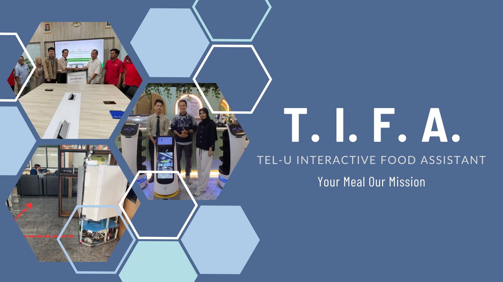

# T.I.F.A - Tel-U Interactive Food Assistant 🚚🍱  



*Gambar di atas adalah placeholder, ganti dengan gambar terkait proyek.*

---

## 🛠️ Tentang Proyek  
**T.I.F.A** (Tel-U Interactive Food Assistant) adalah **Robot Autonomous Pengantar Makanan**, dirancang untuk meningkatkan efisiensi layanan pengantaran makanan dalam berbagai lingkungan seperti restoran, rumah sakit, atau kantor. Robot ini menggabungkan berbagai teknologi canggih untuk memberikan pengalaman pengantaran makanan yang modern dan efektif.

---

## ✨ Fitur Utama  

- **🚪 Pintu Otomatis**  
  Pintu robot yang dapat membuka dan menutup secara otomatis, menjaga makanan tetap higienis dan aman selama pengantaran.  

- **📤 Tray Otomatis**  
  Tray yang dapat bergerak keluar-masuk secara otomatis untuk memudahkan pengguna mengambil atau meletakkan makanan.  

- **🎨 Antarmuka Pengguna (UI) yang Menarik**  
  Layar interaktif dengan tampilan yang ramah pengguna, memberikan informasi status pengantaran, rute, dan waktu estimasi secara real-time.  

- **⚡ Kapasitas Beban Hingga 10 kg**  
  Mampu mengangkut beban hingga 10 kg, memastikan fleksibilitas untuk berbagai jenis pengantaran makanan.  

- **🔄 Pergerakan Diagonal dengan Mekanisme Roda Omnidirectional**  
  Dengan roda omnidirectional, T.I.F.A dapat bergerak secara bebas, termasuk pergerakan diagonal, untuk manuver yang presisi bahkan di ruang sempit.  

- **🔋 Sistem Smart Charge dengan Docking Charge**  
  T.I.F.A dilengkapi dengan baterai pintar yang mampu mengatur pengisian daya secara otomatis. Robot dapat kembali ke docking charge sendiri saat baterai hampir habis, memastikan operasi tanpa gangguan.  

---

## 🔧 Teknologi Pendukung  

T.I.F.A dibangun dengan memanfaatkan teknologi berikut:  
- **Raspberry Pi**: Untuk pemrosesan data utama dan antarmuka pengguna.  
- **Teensy 4.1**: Sebagai pengontrol real-time untuk motor dan perangkat keras lainnya.  
- **ROS Noetic**: Digunakan untuk sistem navigasi dan komunikasi antar modul.  
- **RPLIDAR A2**: Untuk pemetaan dan penghindaran rintangan.  
- **Mekanisme Roda Omnidirectional**: Memberikan kemampuan pergerakan 360 derajat.  
- **Layar Interaktif**: Menampilkan antarmuka pengguna untuk pengoperasian robot.  
- **Sistem Smart Charge dengan Docking Charge**: Untuk pengisian daya otomatis dan efisien.  

---

## 📷 Galeri  

Tambahkan foto dan video T.I.F.A untuk menunjukkan desain, fitur, dan performanya!  
**Gambar placeholder:**  
- **Desain T.I.F.A**:   
- **UI T.I.F.A**:   
- **T.I.F.A dalam Aksi**:   

*Ganti gambar di atas dengan file gambar yang sesuai.*

---

## 📐 Spesifikasi Teknis  

| **Komponen**            | **Detail**                               |  
|--------------------------|------------------------------------------|  
| **Mekanisme Roda**       | Omnidirectional                         |  
| **Kapasitas Beban**      | Hingga 10 kg                            |  
| **Sistem Pintu**         | Pintu otomatis                          |  
| **Tray**                 | Tray otomatis keluar-masuk              |  
| **Antarmuka**            | Layar interaktif dengan UI yang menarik |  
| **Sensor Utama**         | RPLIDAR A2                              |  
| **Platform Software**    | ROS Noetic                              |  
| **Daya**                 | Baterai lithium-ion dengan smart charge |  

---

## 🚀 Cara Menggunakan  

### 1. Persiapan Perangkat Keras  
- Pastikan robot T.I.F.A dirakit sesuai desain, termasuk pemasangan **Raspberry Pi**, **Teensy 4.1**, dan **RPLIDAR A2**.  
- Sambungkan semua komponen sesuai pinout yang telah didefinisikan di dokumentasi hardware.  

### 2. Persiapan Perangkat Lunak  
- **Raspberry Pi**:  
  1. Instal ROS Noetic di Raspberry Pi dengan mengikuti [panduan resmi](http://wiki.ros.org/noetic/Installation).  
  2. Pastikan semua dependensi untuk navigasi dan sensor sudah terpasang:
     ```bash
     sudo apt install ros-noetic-navigation ros-noetic-rplidar-ros
     ```

- **Teensy 4.1**:  
  1. Gunakan Arduino IDE atau PlatformIO untuk mengunggah kode ke Teensy 4.1.  
  2. Library yang diperlukan untuk Teensy:
     - Encoder
     - Servo
     - Teensyduino Core  

- **Kode Sensor**:  
  1. Pastikan driver RPLIDAR A2 sudah terpasang di Raspberry Pi.  
  2. Gunakan perintah berikut untuk menguji RPLIDAR:  
     ```bash
     roslaunch rplidar_ros view_rplidar.launch
     ```

---

## 📋 Roadmap  

- [ ] Tambahkan fitur pengenalan suara untuk kontrol lebih intuitif.  
- [ ] Implementasi sistem navigasi berbasis SLAM untuk rute yang lebih efisien.  
- [ ] Perluasan kapasitas tray untuk beberapa pengantaran sekaligus.  

---

## 💡 Inspirasi  

T.I.F.A terinspirasi oleh kebutuhan akan efisiensi dan higienitas dalam layanan pengantaran makanan, terutama dalam lingkungan dengan interaksi minimal seperti rumah sakit dan kantor.

---

## 🤝 Kontribusi  

Kontribusi sangat diapresiasi! Ikuti langkah berikut untuk berkontribusi:  

1. Fork repository ini.  
2. Buat branch fitur baru (`git checkout -b fitur/namafitur`).  
3. Commit perubahan Anda (`git commit -m 'Tambah fitur baru'`).  
4. Push ke branch (`git push origin fitur/namafitur`).  
5. Buat Pull Request.  

---

## 📧 Kontak  

Jika Anda memiliki pertanyaan atau masalah dengan kode ini, silakan hubungi:  
📬 Email: [kikifachrizi235@gmail.com](mailto:kikifachrizi235@gmail.com)  

---
